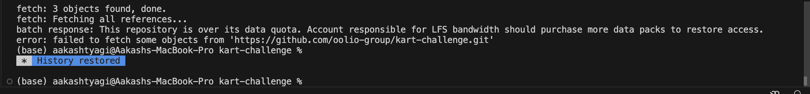

# Kart Challenge

A Golang-based project developed to tackle the karting challenge. This repository demonstrates efficient use of Go for solving a problem of validation coupon code, with large files with clarity and scalability.

---

## Prerequisites

Ensure you have the following installed on your system:

- **Golang**: Version 1.18 or higher
- **Git**: To clone the repository

---

## Setup and Installation

Follow these steps to set up and run the project locally:

1. **Clone the Repository**:
    ```bash
    git clone https://github.com/aakash-tyagi/kart-challenge.git
    cd kart-challenge
    ```

2. **Install Dependencies**:
    ```bash
    go mod tidy
    ```

---
**Important Note**

Due to some technical difficulties, I was unable to download the provided challenge files. As a workaround, I utilized my own files to complete the assignment. Please find attached screenshots of issue I faced, while downloading file:



Please let me know, if something doesn't works with my code and with orignal files, I can update code, according to files
(which you can provide me on google drive also), for maximum efficiency and according to the formatting of text.

Hope it works, with out any changes required.
---

## How to Run

1. **Start the Server**:
    ```bash
    go run main.go
    ```

2. **Access the Application**:
    - The server will be running at `http://localhost:8080` by default.

---

## API Endpoints

### Base URL:
`http://localhost:8080`

### Endpoints:

#### 1. **GET /api/v1/product**
- **Description**: List all products with pagination.
- **cURL Command**:
    ```bash
    curl --location 'localhost:8080/api/v1/product?limit=10&page=1' \
         --header 'Authorization: AUTH_TOKEN'
    ```


#### 2. **GET /api/v1/product/{id}**
- **Description**: Fetch a product by its ID.
- **cURL Command**:
    ```bash
    curl --location 'localhost:8080/api/v1/product/6755cd19c81abe9c83b204c2' \
         --header 'Authorization: AUTH_TOKEN'
    ```


#### 3. **POST /api/v1/order**
- **Description**: Add a new order with multiple items.
- **cURL Command**:
    ```bash
    curl --location 'localhost:8080/api/v1/order' \
         --header 'Authorization: AUTH_TOKEN' \
         --header 'Content-Type: application/json' \
         --data '{
             "couponCode":"HAPPYHOURS",
             "items": [
                 {
                     "productId":"6755cd19c81abe9c83b204c2",
                     "quantity":2
                 },
                 {
                     "productId":"6755cd4ac81abe9c83b204c5",
                     "quantity":2
                 }
             ]
         }'
    ```

---

## Features

- RESTful API for managing kart records
- Efficient and scalable Golang implementation, to work with large files
- Clear structure following Go best practices

---


## Contact

Maintained by [Aakash Tyagi](tyagi01aakash@gmail.com). Feel free to reach out for questions or collaboration opportunities.


